# Phân tích cảm biến MPU6050

[Xem datasheet MPU6050 tại đây](./Datasheet/MPU-6000.pdf)

## 1. Các thông số về độ nhạy

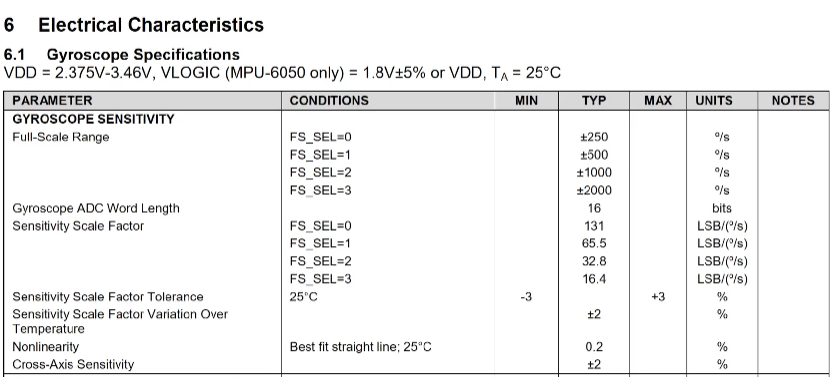

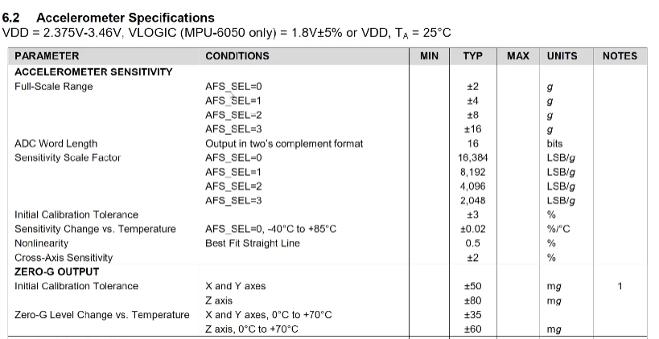

## 2. Các thanh ghi trong MPU6050

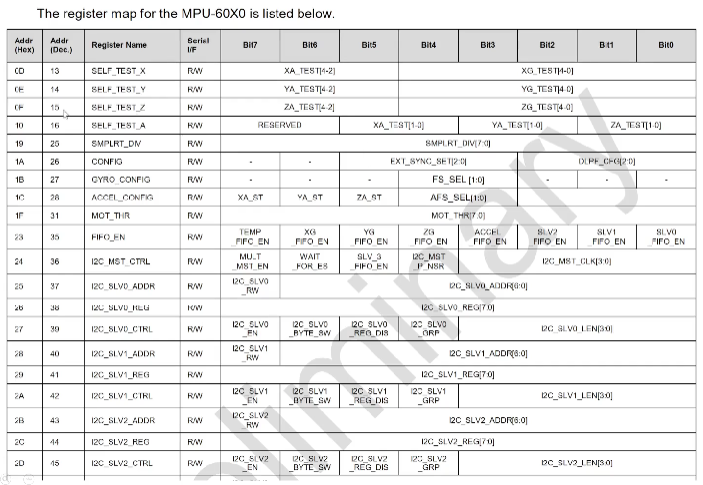

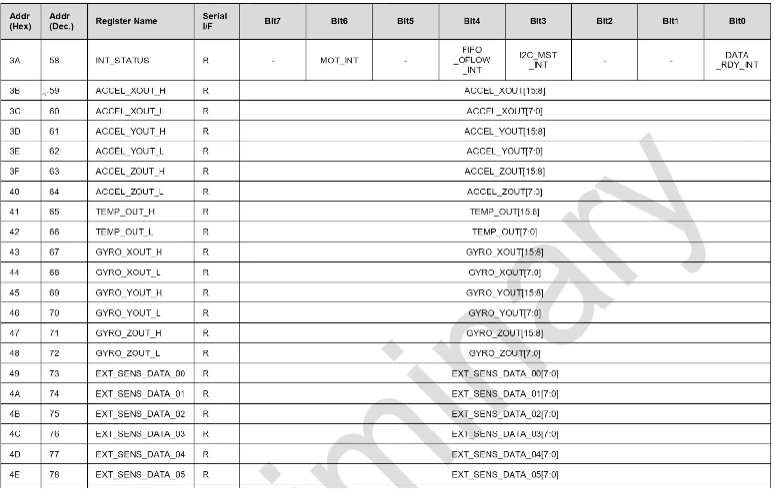

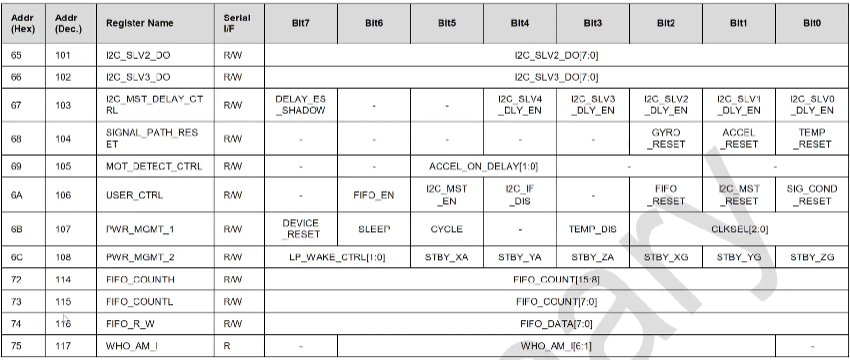

## 3. Thanh ghi 1A

Thanh ghi cấu hình bộ lọc tần số thấp

Tổng có 6 bit nhưng chỉ dùng 3 bit cuối (0, 1, 2) để cấu hình cho DLPF

Các tần số được lọc theo như bảng

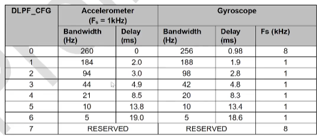

## 4. Thanh ghi 1B

Set độ nhạy của gyroscope là bao nhiêu độ/giây

Sử dụng 2 bit (bit 3, 4) để set giá trị theo bảng

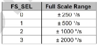

## 5. Thanh ghi 1C

Cấu hình gia tốc

sử dụng 2 bit (bit 3, 4) để set giá trị theo bảng

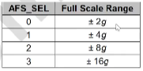

## 6. Thanh ghi 3B - 40 (chỉ đọc)

Là 1 cụm 6 thanh ghi để đo gia tốc 3 trục x, y, z

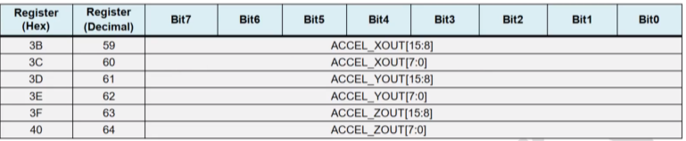

Vì 3 trục đo tín hiệu 16 bit, mà 1 thanh ghi tối đa chỉ 8 bit nên cần ghép 2 thanh ghi lại với nhau

Với giá trị bắt đầu từ thanh ghi 3B là 8 bit cao, sau đó là thấp và cứ thế lần lượt

Khi code, đọc thanh ghi 3B sau đó <<8 | thanh ghi 3C

Sau đó cần chia cho độ phân giải g được quy định theo chế độ tại thanh ghi 1C

## 7. Thanh ghi 43 - 48 (chỉ đọc)

Là 1 cụm 6 thanh ghi để đo cpn quay hồi chuyển (vận tốc góc) 3 trục x, y, z

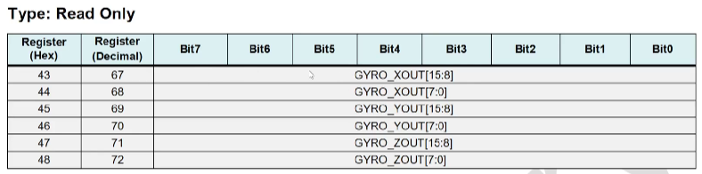

Vì 3 trục đo tín hiệu 16 bit, mà 1 thanh ghi tối đa chỉ 8 bit nên cần ghép 2 thanh ghi lại với nhau

Với giá trị bắt đầu từ thanh ghi 3B là 8 bit cao, sau đó là thấp và cứ thế lần lượt

Khi code, đọc thanh ghi 43 sau đó <<8 | thanh ghi 44

Tương tự với gia tốc, con quay hồi chuyển (vận tốc góc) cũng cần chia cho độ phân giải giây được quy định theo chế độ tại thanh ghi 1B

## 8. Thanh ghi 6B

Thông thường, ban đầu sẽ reset thanh ghi này về 0

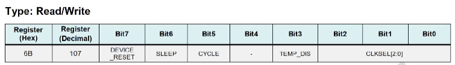

## Quy trình code

- Reste thanh ghi 6B về 0

- Đọc dữ liệu 6 thanh ghi từ 3B - 40 lấy dữ liệu gia tốc

- Đọc dữ liệu 2 thanh ghi từ 41 - 42 để lấy dữ liệu nhiệt độ

- Đọc dữ liệu 6 thanh ghi từ 43 - 48 lấy dữ liệu góc xoay (vận tốc góc)

- Ghi 3 thanh ghi 1A 1B 1C:

  - 1A để set lọc tần số thấp

  - 1B để set gyro_config

  - 1C để set gia tốc góc

## Wiring

| MPU6050 | ESP32 |
| --- | --- |
| VCC | 3.3V / 5V |
| GND | GND |
| SDA | GPIO21 |
| SCL | GPIO22 |
